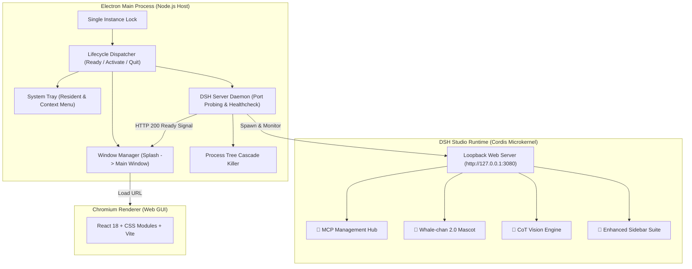

# DSH WhaleDeck · Modern DeepSeek Harness Full-Stack Agent Workbench

<p align="center">
  
</p>

<p align="center">
  <strong>🔥 A modern desktop client and full-stack plugin suite for DeepSeek Harness — built for newcomers and geek developers alike.</strong>
</p>

<p align="center">
  <strong>English</strong> | <a href="./README.zh.md">简体中文</a>
</p>

<p align="center">
  <a href="https://github.com/jiuge2467/DSH-WhaleDeck/releases"></a>
  <a href="LICENSE"></a>
  <a href="https://img.shields.io/badge/Platform-Windows%20x64%20|%20macOS%20arm64-blueviolet?style=flat-square" alt="Platform" /></a>
  <a href="https://img.shields.io/badge/Electron-35.0.0-47848F?style=flat-square&logo=electron" alt="Electron" /></a>
  <a href="https://img.shields.io/badge/PRs-welcome-brightgreen.svg?style=flat-square" alt="PRs Welcome" /></a>
</p>

---

## 📖 Introduction

**DSH WhaleDeck** is an out-of-the-box desktop client and full-stack plugin suite built on top of DeepSeek's official open-source agent framework, [DeepSeek Harness (DSH)](https://github.com/deepseek-ai/deepseek-harness).

While upstream DSH is exceptionally capable, its native CLI interface and runtime prerequisites (`Node.js >= 22.19`, `pnpm`, manual terminal orchestration) present a steep learning curve for many. **DSH WhaleDeck bridges this gap**:

1. **For Beginners & Everyday Users**: Provides standalone, one-click desktop installers with bundled runtimes and curated plugins — just double-click and experience cutting-edge AI Agent workflows instantly.
2. **For DSH Plugin Developers**: Offers a rich development, debugging, and showcase platform equipped with multi-source MCP aggregation, CoT vision inspection, an interactive mascot pet, and an industrial-grade sidebar.

<p align="center">
  
</p>

---
## 📥 Download

| Platform | Download Link | File Size |
| :--- | :--- | :--- |
| **Windows (x64)** | [👉 Download Windows Installer (.exe)](https://github.com/jiuge2467/DSH-WhaleDeck/releases/download/v1.0.0/DSH.Studio-0.1.0-rc.5-win-x64.exe) | ~234 MB |

> 💡 **Tip**: For older versions or detailed changelogs, please visit the [GitHub Releases](https://github.com/jiuge2467/DSH-WhaleDeck/releases) page.

## ✨ Key Highlights

* 🚀 **Zero-Configuration Desktop Client**: Standalone installers for Windows x64 and macOS Apple Silicon — no manual Node.js or CLI setup needed.
* 🐬 **Whale-chan 2.0 Mascot Companion**: An interactive desktop companion featuring 3 ultra-fine skins, real-time token/TPS billing, feed interactions, mini-games, and a food decision wheel.
* 🧰 **Industrial Geek Sidebar**: Fully equipped with an embedded workspace File Explorer, visual Git diff & history inspector, persistent ConPTY terminal, and Kanban Task Board.
* 🔌 **Visual Multi-Source MCP Hub**: Automatically discovers workspace & global MCP configurations (Cursor / Claude / Gemini / DSH) with an online single-tool RPC testing sandbox.
* 🧠 **CoT Multimodal & Reasoning Engine**: Seamlessly parses and reveals detailed `reasoning_content` chains from thinking-capable multimodal models.
* 💬 **Session Lifecycle Management**: Visual session forking (branching), renaming, archiving, and deletion directly from the UI.
* 🛡️ **Clean & Resilient Architecture**: Guaranteed process tree lifecycle management without orphan processes, single-instance locking, and system tray residency for uninterrupted agent tasks.

---

## 🧩 Core Feature Tour

### 🐬 1. Whale-chan 2.0 Mascot Companion (`dsh-mascot-pet`)

> **Pain Point Solved**: Long hours of agent debugging and programming can feel sterile; lacks empathetic feedback and quick mental breaks.

#### 👗 3 High-Precision Transparent Skins (Skins & Outfits)
Instant, one-click skin switching among **Classic Maid Outfit**, **Cyber Mecha Hacker**, and **Summer Sailor Uniform** without page reloads.

<p align="center">
  
</p>

#### 🎮 Interactive Entertainment & Real-Time Monitoring Matrix
Whale-chan integrates real-time token monitoring, feeding gamification, mini-games, and geek humor to keep you energized:

| 📊 实时用量与 TPS 监控 (Token Billing) | 🍉 零食投喂与好感度 (Feed & Affinity) |
| :---: | :---: |
|  |  |
| **实时开销看板**：当前会话消费、全站累计、实时 TPS 吞吐、缓存命中率与月度预算进度。 | **投喂养成系统**：西瓜、奶茶、甜甜圈与草莓蛋糕投喂，好感度升级与饱腹感活力管理。 |

| 🕹️ 摸鱼小游戏大厅 (Mini-Games) | 🎲 美食决策转盘 (Food Wheel) |
| :---: | :---: |
|  |  |
| **摸鱼解压小游戏**：内置星海小水泡反应大作战、2048 极光、霓虹打砖块游戏大厅。 | **程序员终极难题解法**：“今天吃什么？”交给小鲸鱼姬随机轮盘一键抽奖决定！ |

<p align="center">
  
  <br />
  <em>💡 程序员专属脑洞解压笑话库（二进制度、程序员幽默每日放送）</em>
</p>

---

### 🧰 2. Industrial Geek Sidebar Suite (`dsh-better-sidebar`)

> **Pain Point Solved**: Standard DSH lacks an embedded file explorer, terminal, and task board, forcing constant context switching between VSCode, terminal tabs, and browsers.

* **7-in-1 Workbench Navigation**: Seamlessly switch across **File Explorer**, **Source Control (Git)**, **Task Board**, **Integrated Terminal**, **Agent Skills**, **MCP Management**, and **Embedded Browser**.
* **Visual Kanban Task Board**: Real-time 5-column task progress tracking (**Planned / Todo / In-Progress / Done / Failed**) across durable agent workflows.
* **Persistent PTY Terminal**: Built-in Windows ConPTY / Unix PTY shell sessions supporting full CLI commands directly alongside the agent chat.

| 🗂️ 多标签工作台菜单 (Sidebar Menu) | 📋 5 列可视化任务看板 (Task Board Kanban) |
| :---: | :---: |
|  |  |

<p align="center">
  
  <br />
  <em>💻 内置持久化终端：免切窗口直接执行 Shell/PowerShell 命令</em>
</p>

---

### 🔌 3. Visual Multi-Source MCP Hub (`dsh-better-sidebar-mcp`)

> **Pain Point Solved**: Model Context Protocol (MCP) server configurations are traditionally scattered across different tools (`.cursor`, `.vscode`, `Claude Desktop`), making them difficult to locate, test, and troubleshoot.

* **Multi-Source Automatic Aggregation**: Deep-scans both workspace configs (`./mcp.json`, `.vscode/mcp.json`, `.cursor/mcp.json`, `.agents/mcp_config.json`) and global environments (Claude Desktop, Cursor, Antigravity/Gemini, `~/.dsh/mcp.json`).
* **Tool Tester Sandbox Modal**: Visualizes parameter JSON Schemas, auto-fills default test arguments, performs live RPC handshakes, and reports millisecond-level execution latencies.
* **10 Curated Official Presets**: Pre-configured templates for GitHub, SQLite, Web Fetch, Brave Search, Puppeteer, PostgreSQL, Memory, Filesystem, Everything, and Git with smooth horizontal scrolling.
* **Batch JSON Import & Hot Toggling**: Paste any raw `mcpServers` JSON block for instant parsing; toggle servers on/off dynamically without service restarts.

| 🔌 MCP 服务管理中心 (MCP Manager) | 🧪 单工具在线 RPC 调试沙箱 (Tool Tester) |
| :---: | :---: |
|  |  |

---

### 🧠 4. CoT Multimodal & Reasoning Engine (`dsh-tool-describe-image`)

> **Pain Point Solved**: Thinking-capable multimodal LLMs frequently emit empty streaming `content` tokens during their initial reasoning phases, resulting in blank screens or lost chain-of-thought visibility.

* **Chain-of-Thought (CoT) Compatibility**: Tailored for models with deep reasoning (e.g. Xiaomi MiMo, DeepSeek-R1 series), parsing and displaying `reasoning_content` blocks seamlessly in real time.
* **Graphical Connectivity & Model Discovery**: One-click endpoint health checks, round-trip latency benchmarks, and automatic enumeration of upstream vendor model lists.

<p align="center">
  
</p>

---

### 💬 5. Session Lifecycle Management & Forking

> **Pain Point Solved**: Exploring multiple solution branches previously required manually creating sessions and copy-pasting conversation histories.

* **Session Forking (Branching)**: Fork any session at its current state to test alternative prompts or code paths independently.
* **Inline Organization**: Rename, archive, and cleanly delete sessions with custom context actions.

<p align="center">
  
</p>

---

## 🚀 Installation & Quick Start

Choose from three flexible installation methods based on your experience level:

```
                    ┌──────────────────────────────────────────────┐
                    │       How would you like to use DSH Studio?   │
                    └──────────────────────┬───────────────────────┘
                                           │
                 ┌─────────────────────────┴─────────────────────────┐
                 ▼                                                   ▼
     【Everyday Users / Beginners】                              【Developers & Power Users】
                 │                                                   │
   Download Standalone Installer (Method 0)              ┌─────────────┴─────────────┐
        • Windows: .exe (NSIS)                           ▼                           ▼
        • macOS: .dmg                               Build from Source (Method 1)  Install into Existing DSH (Method 2)
        • Zero dependencies, 1-click launch          • pnpm install                • dsh plugin add ...
                                                     • Hack & contribute           • Mix & match
```

### Method 0: Standalone Desktop Installer (Recommended for Beginners)

Designed for users who want a hassle-free experience. The installer includes the full Node.js runtime and all DSH Studio core plugins out of the box.

| Operating System | Package Format | Architecture | Installation Notes |
| :--- | :--- | :--- | :--- |
| **Windows** | `DSH-Studio-Setup-*.exe` | x64 (64-bit) | Run the NSIS setup wizard; automatically creates desktop and start menu shortcuts |
| **macOS** | `DSH-Studio-*.dmg` | Apple Silicon (arm64, M1/M2/M3/M4) | Open the DMG image and drag `DSH Studio.app` into your `Applications` folder |

> [!TIP]
> **macOS Gatekeeper prompt on first launch?**
> 1. Go to **System Settings** > **Privacy & Security** > scroll down to find DSH Studio and click **"Open Anyway"**;
> 2. Or bypass directly in your terminal:
>    ```bash
>    xattr -cr /Applications/DSH\ Studio.app
>    ```

---

### Method 1: Build & Run from Source (Developer Mode)

Ideal for developers who wish to customize plugins, modify the frontend, or contribute to DSH Studio (requires `Node.js >= 22` and `pnpm 11+`):

```bash
# 1. Clone the repository
git clone https://github.com/jiuge2467/DSH-WhaleDeck.git
cd DSH-WhaleDeck

# 2. Install dependencies and build all packages
pnpm install
pnpm run build

# 3. Launch the DSH Web workbench (listens on 0.0.0.0:3080)
pnpm dsh web --host 0.0.0.0
```

Open `http://127.0.0.1:3080` in your web browser to start exploring.

---

### Method 2: Add Plugins to an Existing DSH Environment

If you already have upstream DSH installed and running, you can add individual DSH Studio plugins directly to your `web` profile:

```bash
# 1. Install MCP Visual Management Hub
cd ~/.dsh && dsh plugin --profile web add dsh-better-sidebar-mcp

# 2. Install Enhanced Sidebar (Explorer, Git, Terminal, Task Board)
cd ~/.dsh && dsh plugin --profile web add dsh-better-sidebar

# 3. Install Whale-chan Mascot Pet 2.0
cd ~/.dsh && dsh plugin --profile web add dsh-mascot-pet
```

Restart `dsh web` to activate the plugins.

---

## 🏗️ Architecture & Technology Stack

DSH Studio Desktop is built on a **"Thin Electron Host + Process Tree Daemon + Local Loopback Web Application"** decoupled architecture:



### Technology Matrix

| Layer | Component / Tool | Purpose & Rationale |
| :--- | :--- | :--- |
| **Desktop Shell** | `Electron ^35.0.0` | Cross-platform container providing system tray, native menus, and single-instance locks |
| **Packaging** | `electron-builder ^25.1.8` | Generates Windows NSIS setup binaries and macOS DMG disk images |
| **Frontend UI** | `React 18` + `CSS Modules` | Modern, responsive interface with frosted-glass design language |
| **Plugin Kernel** | `Cordis` + `DSH Core` | Highly modular microkernel supporting dynamic lifecycle effects and zero-coupling extensions |
| **Language** | `TypeScript` (Strict ESM) | Strict end-to-end type safety and explicit JSDoc contracts across packages |
| **Build Tools** | `pnpm` + `tsdown` + `Vite` | Monorepo dependency management and rapid bundle compilation |
| **Testing** | `Vitest` | Unit, integration, snapshot, and regression test suites |
| **CI/CD** | `GitHub Actions` | Cross-platform build matrix and automated GitHub Release asset dispatch |

---

## 🧩 Bundled Plugins, References & Optimizations

DSH Studio stands on the shoulders of the vibrant DeepSeek Harness and open-source Agent community. We bundle, adapt, and significantly optimize several foundational plugins to deliver a seamless, industrial-grade desktop experience:

| Plugin Package | Role & Features | Upstream / Reference | Key Optimizations & Enhancements in DSH Studio |
| :--- | :--- | :--- | :--- |
| **`dsh-mascot-pet`** | 🐬 Whale-chan 2.0 Mascot Companion | Community Mascot & Pet concepts | • **Zero-Residue Lifecycle**: Fixed bug where popup bubbles and wander loops persisted when disabled (`return null` fail-fast DOM unmount + `wanderEngine.interrupt()`).<br>• **Skins Center**: Built 3 high-precision outfits (Classic Maid / Cyber Hacker / Summer Sailor) with instant switching.<br>• **Fast-Paced Vocabulary**: 650ms auto-advancing GRE/CET-4 flashcards with A/B/C/D keyboard blind-typing.<br>• **Mini-Game & Decision Hub**: Built-in 2048 Aurora, Starry Bubbles, Neon Bricks, and Food Decision Wheel.<br>• **Live Token Billing**: Real-time session expenditure, historical total, TPS throughput, and budget gauges. |
| **`dsh-better-sidebar-mcp`** | 🔌 Visual Multi-Source MCP Hub | Community MCP Tools & Protocol | • **Cross-Tool Auto Discovery**: Deep-scans `./mcp.json`, `.cursor/`, `.vscode/`, `Claude Desktop`, `Gemini/Antigravity`, and `~/.dsh/`.<br>• **Interactive Tool Tester**: In-GUI JSON Schema parameter visualization, live RPC payload execution, and latency benchmarks.<br>• **Batch JSON Parser**: One-click import for raw `mcpServers` JSON snippets with hot enable/disable toggling. |
| **`dsh-better-sidebar`** / **`dsh-task-board`** | 🧰 7-in-1 Geek Sidebar & Task Board | Community Sidebar & Kanban | • **7-in-1 Multi-Tab Hub**: Seamless switching across Explorer, Git, Task Board, Terminal, Skills, MCP, and Browser.<br>• **Persistent PTY Terminal**: Full ConPTY / PTY shell integration supporting direct CLI command execution.<br>• **5-Column Task Kanban**: Real-time visual progress tracking across durable agent workflow states. |
| **`dsh-tool-describe-image`** | 🧠 CoT Multimodal Reasoning Engine | Multimodal Vision Tool | • **Thinking Model Compatibility**: Custom streaming parser for deep-reasoning multimodal models (e.g. Xiaomi MiMo, DeepSeek-R1), preventing blank screens and preserving complete `reasoning_content` chains.<br>• **Connectivity Benchmark**: Visual endpoint health checks, round-trip latency metrics, and upstream model discovery. |
| **`dsh-web-ui-settings`** | ⚙️ Studio Enhanced Plugin Config Hub | Web UI Settings | • **Studio Brand Overhaul**: Modernized full-stack plugin configuration UI, removing legacy strings in favor of unified DSH Studio branding.<br>• **Local Settings Bridge**: Implemented loopback RPC bridge for seamless third-party namespace mutations. |
| **`dsh-liangshen`** | ⚡ Custom Agent Preset (Nanliang Mode) | Community Agent Presets | • Specialized V4 Pro prompt guidance and custom preset template management. |

### 🌐 Open-Source Community Ecosystem References

We also express our sincere gratitude to the following community projects integrated into our community plugin directory:
* 📊 [**dsh-data-agent**](https://github.com/omdsh-dev/dsh-data-agent) by `@omdsh-dev`: Dedicated Data Agent preset for database querying, updates, and analysis.
* 📟 [**dsh-TUI**](https://github.com/ccch1mneyyy/dsh-TUI) by `@ccch1mneyyy`: Claude Code-style fullscreen interactive terminal plugin with pixel-whale header and TPS meters.
* 📜 [**dsh-tianshu-tui**](https://github.com/huiliyi37/dsh-tianshu-tui) by `@huiliyi37`: TDD and evidence-gate terminal UI for DeepSeek Harness.
* 📝 [**dsh-chat-summary**](https://github.com/v833/dsh-chat-summary) by `@v833`: Export conversations to Markdown / DOCX / PDF with optional LLM smart summarization.
* 🔍 [**dsh-builtin-toggles**](https://github.com/Starfie1d1272/dsh-builtin-toggles) by `@Starfie1d1272`: Evidence-backed built-in capability inspector with fail-closed switches.

---

We believe in radical transparency in open source. Here is our balanced assessment of DSH Studio's strengths and current limitations:

### 🌟 Strengths (Pros)
1. **Zero-Friction Onboarding**: Pre-built desktop packages completely eliminate Node.js, pnpm, and terminal dependencies for beginners.
2. **Curated Out-of-the-Box Suite**: Five core plugins pre-installed — no manual config editing or fragile plugin installation steps.
3. **Unified MCP Central Hub**: Seamlessly connects Cursor, Claude Desktop, VSCode, and DSH configurations with live tool debugging.
4. **Pure Modular Extensibility**: Adheres to upstream DSH Cordis standards; every feature is an isolated bundle that can be removed or extended.
5. **Robust System Tray Residency**: Closes to tray to keep long-running background Agent tasks alive and safe from accidental closure.
6. **Fully Open Source**: Licensed under the permissive [MIT License](LICENSE) with clean, auditable code.

### ⚠️ Current Limitations & Mitigations (Cons)
1. **Desktop Package Targets**: Pre-built packages currently target Windows x64 and macOS Apple Silicon (arm64). *Linux users can run smoothly via source code (Method 1).*
2. **macOS Gatekeeper Warning**: Self-signed binaries may trigger an unsigned app prompt on macOS. *Easily bypassed in System Settings or via `xattr -cr`.*
3. **API Keys Required**: DSH Studio is a local orchestration workbench; *users must supply their own DeepSeek or OpenAI-compatible API credentials.*
4. **Installer Binary Size**: Bundling the full Node.js runtime and Chromium engine yields a larger download footprint than pure CLI tools. *Ongoing optimization through ASAR compression and tree-shaking.*
5. **Cloud Plugin Marketplace in Progress**: An in-app one-click cloud store is currently on the roadmap for future releases.

---

## 🧪 Testing & Quality Assurance

DSH Studio is verified against comprehensive unit, integration, and snapshot test suites:

```bash
# Run full repository unit tests
pnpm test

# Run CI coverage audit (strict gate)
pnpm run test:coverage

# Run tests for a specific plugin package (e.g. Mascot Pet)
pnpm --filter dsh-mascot-pet test
```

---

## 🤝 Contributing

Contributions from the community are warmly welcomed! Whether reporting bugs, designing new skins, crafting plugins, or improving documentation:

1. **Fork** this repository
2. Create your feature branch: `git checkout -b feat/YourAwesomeFeature`
3. Commit your changes: `git commit -m 'feat: add some amazing feature'`
4. Push to the branch: `git push origin feat/YourAwesomeFeature`
5. Open a **Pull Request**

Please check [CONTRIBUTING.md](CONTRIBUTING.md) for details.

---

## 📄 License

This project is licensed under the [MIT License](LICENSE).
