# DSH WhaleDeck · 现代化 DeepSeek Harness 全栈增强工作台

<p align="center">
  
</p>

<p align="center">
  <strong>🔥 专为编程小白与极客开发者打造的 DeepSeek Harness 桌面客户端与全栈增强插件套件</strong>
</p>

<p align="center">
  <a href="./README.md">English</a> | <strong>简体中文</strong>
</p>

<p align="center">
  <a href="https://github.com/jiuge2467/DSH-WhaleDeck/releases"></a>
  <a href="LICENSE"></a>
  <a href="https://img.shields.io/badge/Platform-Windows%20x64%20|%20macOS%20arm64-blueviolet?style=flat-square" alt="Platform" /></a>
  <a href="https://img.shields.io/badge/Electron-35.0.0-47848F?style=flat-square&logo=electron" alt="Electron" /></a>
  <a href="https://img.shields.io/badge/PRs-welcome-brightgreen.svg?style=flat-square" alt="PRs Welcome" /></a>
</p>

---

## 📖 项目简介

**DSH WhaleDeck** 是基于 DeepSeek 官方开源 Agent 框架 [DeepSeek Harness (DSH)](https://github.com/deepseek-ai/deepseek-harness) 打造的**全栈增强工作台与开箱即用桌面客户端**。

官方 DSH 功能极其强大，但原生基于命令行且对运行环境（Node.js >= 22.19、pnpm、繁琐的终端编排）有较高要求。**DSH WhaleDeck 的初衷**是打破使用门槛：

1. **对编程小白与普通用户**：提供一键安装的桌面独立安装包，内置完整运行时与核心插件，双击即可上手体验顶尖的 AI Agent 工作流；
2. **对 DSH 插件开发者**：提供集成了 MCP 多源管理、CoT 视觉分析、极客桌宠与全功能侧边栏的现代化开发、调试与展示平台。

<p align="center">
  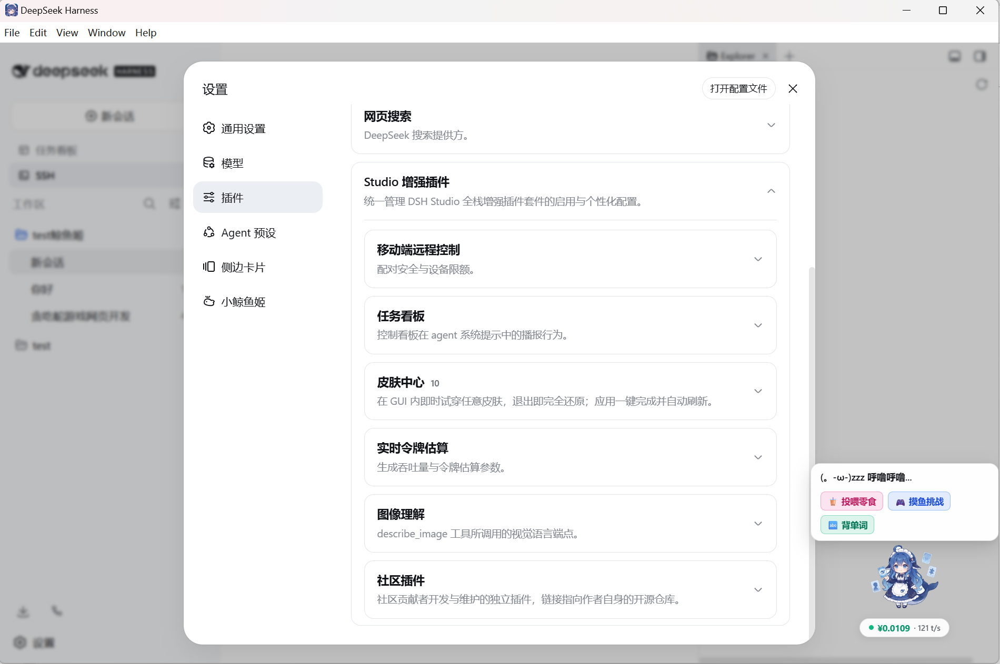
</p>

---
## 📥 软件下载

| 系统平台 | 下载链接 | 文件大小 |
| :--- | :--- | :--- |
| **Windows x64** | [👉 点击直接下载 Windows 安装包 (.exe)](https://github.com/jiuge2467/DSH-WhaleDeck/releases/download/v1.0.0/DSH.Studio-0.1.0-rc.5-win-x64.exe) | ~234 MB |

> 💡 **提示**：如果下载速度较慢，请多次刷新或使用下载加速工具。
## ✨ 核心亮点一览

* 🚀 **零门槛双击即用**：提供 Windows x64 与 macOS Apple Silicon 独立桌面安装包，无需手动配置 Node.js 或终端命令。
* 🐬 **小鲸鱼姬 2.0 灵动桌宠**：常驻桌面伴侣，提供 3 套高精无痕立绘、实时 Token 账单监控、零食投喂、摸鱼小游戏与美食转盘。
* 🧰 **工业级增强侧边栏**：无缝内嵌代码资源管理器、Git 可视化历史差异比对、持久化 PTY 终端与任务看板。
* 🔌 **MCP 多源可视化中枢**：全自动扫描工作区与全局（Cursor / Claude / Gemini / DSH）MCP 配置，内置单工具在线 RPC 调试沙箱。
* 🧠 **CoT 视觉思考链引擎**：深度兼容带深度思考的多模态大模型，即便无即时正文输出亦能解析完整 `reasoning_content` 推理链路。
* 💬 **会话分支与生命周期**：支持会话一键 Fork 分叉测试不同方案、重命名、归档与无痕清理。
* 🛡️ **纯净且健壮的架构**：进程树级联回收无僵尸进程残留，单实例锁防端口冲突，托盘驻留保障 Agent 长程任务不中断。

---

## 🧩 核心功能深度巡礼

### 🐬 1. 小鲸鱼姬 2.0 灵动桌宠与解压伴侣 (`dsh-mascot-pet`)

> **解决的痛点**：长时间的 Agent 编码与调试枯燥乏味；缺乏对智能体运行状态的即时情感反馈与轻量级解压手段。

#### 👗 3 套高精无痕立绘 (形象与换装中心)
在「设置 > 小鲸鱼姬」中可一键无缝切换 **经典女仆**、**赛博极客**、**夏日水手** 三套立绘，免刷新即时蜕变生效。

<p align="center">
  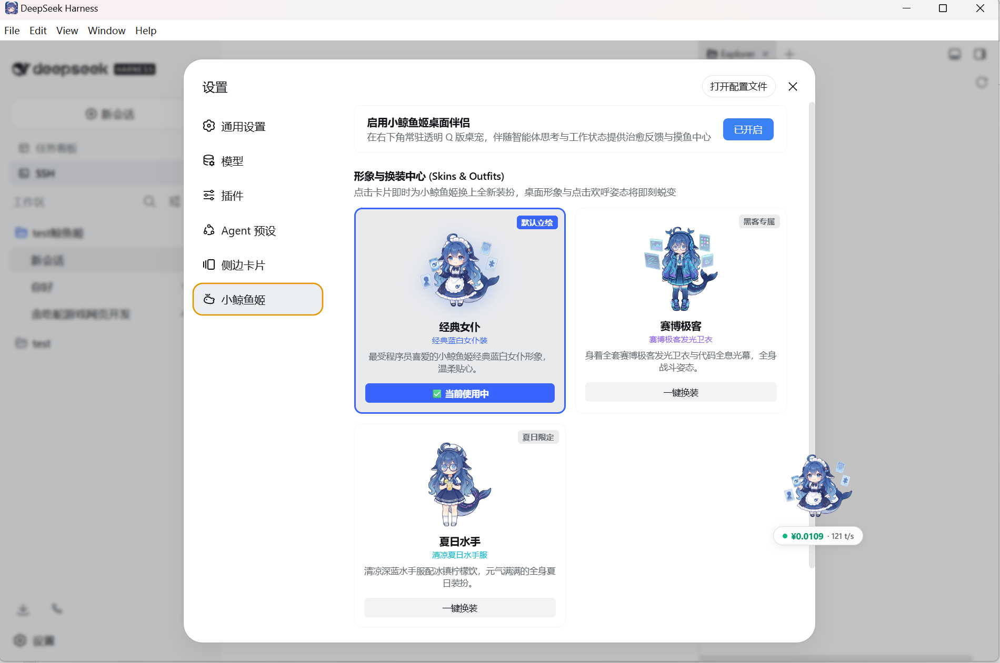
</p>

#### 🎮 多维互动与实时监控矩阵
小鲸鱼姬不仅是可爱的桌面陪伴，更是兼具实时 Token 计费、投喂养成、益智小游戏与极客幽默的综合中枢：

| 📊 实时用量与 TPS 监控 | 🍉 零食投喂与好感度养成 |
| :---: | :---: |
| 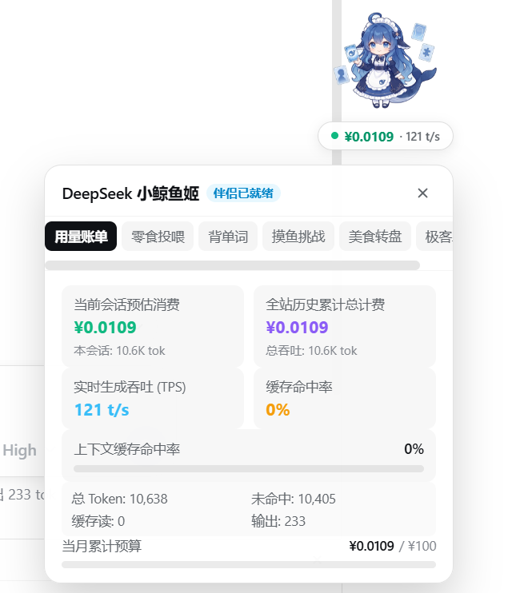 | 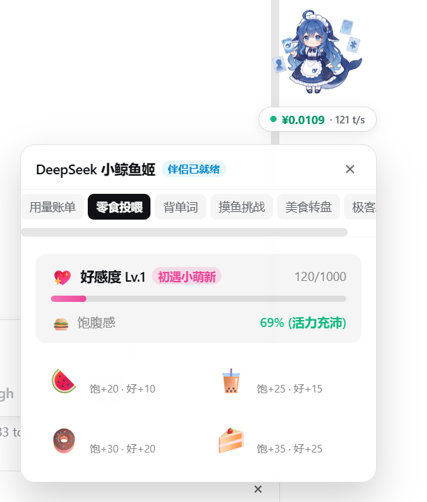 |
| **实时开销看板**：当前会话消费、全站历史累计计费、实时 TPS 生成吞吐、缓存命中率与当月预算进度。 | **投喂互动系统**：西瓜、奶茶、甜甜圈与草莓蛋糕投喂，好感度升级与饱腹感活力管理。 |

| 🕹️ 摸鱼挑战小游戏大厅 | 🎲 美食决策转盘 |
| :---: | :---: |
| 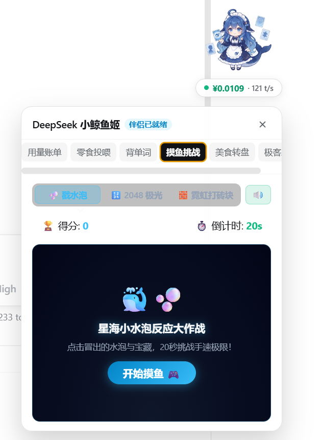 | 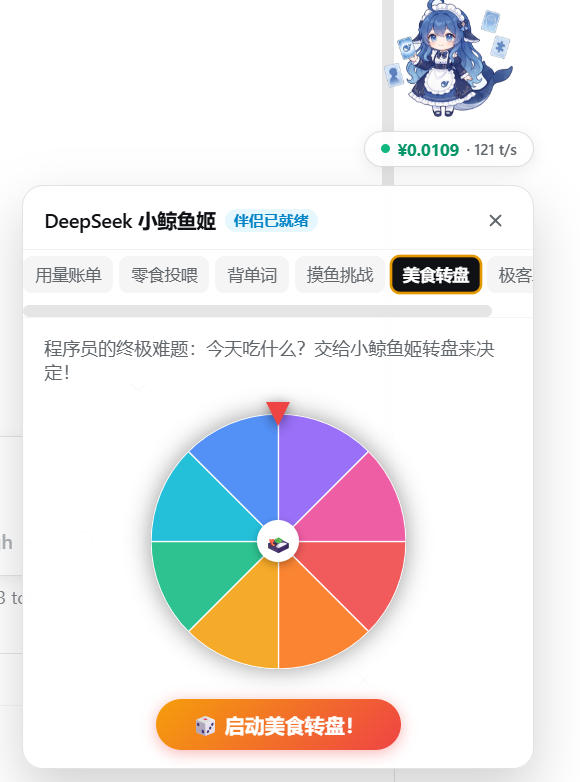 |
| **解压小游戏**：内置星海小水泡反应大作战、2048 极光、霓虹打砖块游戏大厅，20 秒极速挑战手速！ | **程序员终极难题解法**：“今天吃什么？”交给小鲸鱼姬随机轮盘一键抽奖决定！ |

<p align="center">
  
  <br />
  <em>💡 程序员专属脑洞解压笑话库（二进制度、经典脑洞幽默每日放送）</em>
</p>

---

### 🧰 2. 工业级极客增强侧边栏 (`dsh-better-sidebar`)

> **解决的痛点**：官方 DSH 缺少文件树与内置终端，开发者频繁在 VSCode、命令行和浏览器窗口之间来回切换，破坏心流。

* **7 合 1 工作台快捷切换**：一键无缝唤出 **资源管理器**、**源代码管理 (Git)**、**任务管理**、**终端**、**Agent 技能**、**MCP 管理** 与 **内置浏览器**。
* **5 列可视化任务看板**：实时追踪会话任务状态（**待处理 / 待办 / 进行中 / 已完成 / 已失败**），长程复杂任务进展一目了然。
* **内置持久化终端**：集成原生 Windows ConPTY / Unix PTY 命令行会话，无需脱离当前 Agent 界面直接执行 Shell / PowerShell 指令。

| 🗂️ 多标签工作台菜单 | 📋 5 列可视化任务看板 |
| :---: | :---: |
| 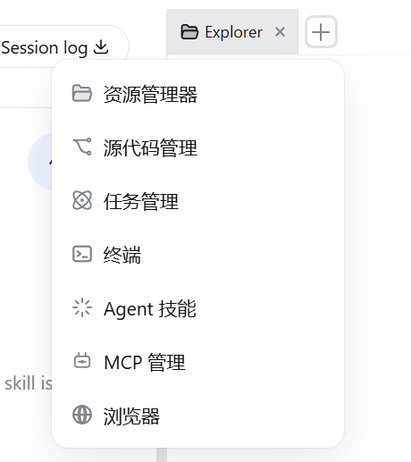 | 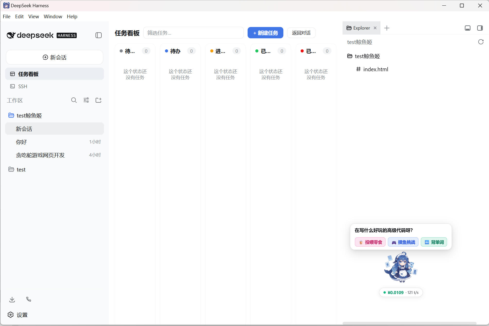 |

<p align="center">
  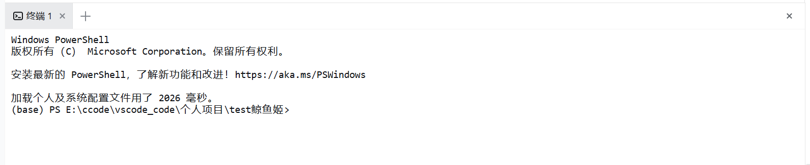
  <br />
  <em>💻 内置持久化终端：免切窗口直接执行 Shell/PowerShell 调试命令</em>
</p>

---

### 🔌 3. MCP 多源可视化管理中枢 (`dsh-better-sidebar-mcp`)

> **解决的痛点**：MCP 配置分散在 `.cursor`、`.vscode`、`Claude Desktop` 等不同工具中，查找繁琐且缺少独立的在线调用调试手段。

* **全环境自动扫描聚合**：深度扫描工作区（`./mcp.json`、`.vscode/mcp.json`、`.cursor/mcp.json`、`.agents/mcp_config.json`）与全局环境（Claude Desktop、Cursor、Gemini/Antigravity、`~/.dsh/mcp.json`）。
* **Tool Tester 在线调试沙箱**：可视化呈现入参 JSON Schema，自动填充测试样例，发起真实 RPC 调用并毫秒级统计延迟。
* **10 大官方常用预设**：开箱即用集成 GitHub、SQLite、Web Fetch、Brave Search、Puppeteer、PostgreSQL、Memory 等实用模板。
* **批量导入与热插拔**：直接粘贴 `mcpServers` JSON 片段即时导入，支持单服务独立启停，无需重启后端。

| 🔌 MCP 服务管理中心 | 🧪 单工具在线 RPC 调试沙箱 |
| :---: | :---: |
| 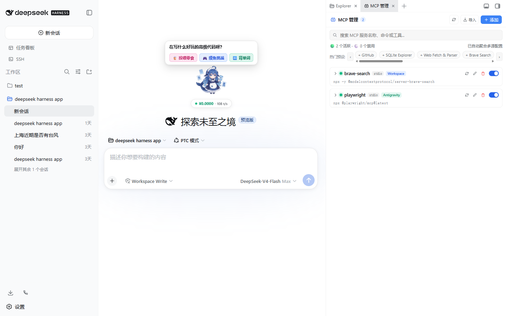 | 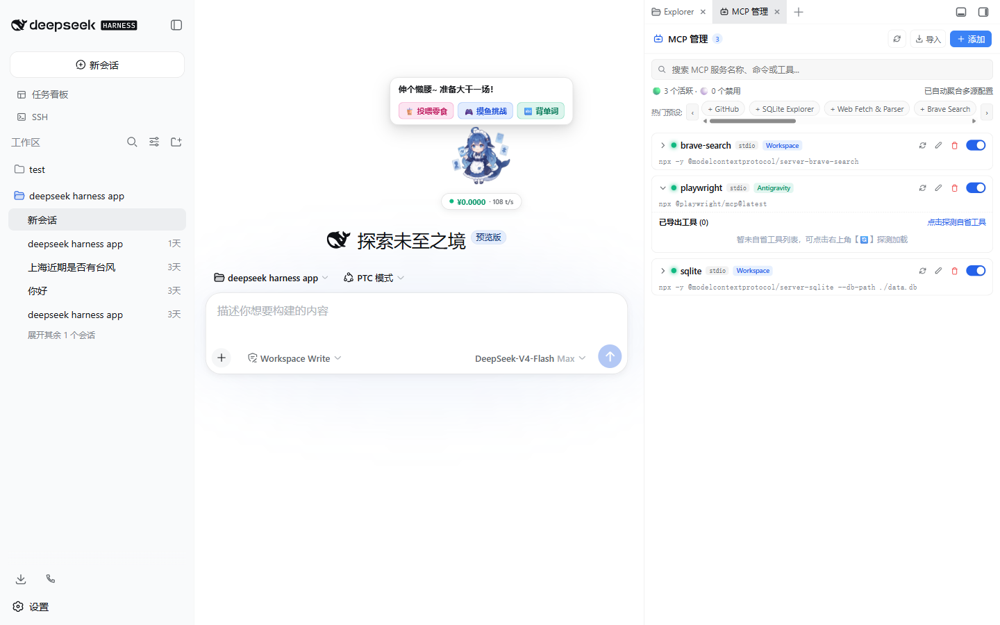 |

---

### 🧠 4. CoT 视觉思考链深度解析 (`dsh-tool-describe-image`)

> **解决的痛点**：具备推理能力的多模态大模型在生成前往往有大量思考链，传统解析器在无即时正文时易出现空白卡死或丢弃思考过程。

* **思维链 (CoT) 深度兼容**：专为深度思考多模态模型（如 Xiaomi MiMo、DeepSeek-R1 系列）优化，实时完整呈现 `reasoning_content` 推理折叠块。
* **可视化连通性测试与模型嗅探**：支持一键端点连通探测与往返延迟测速，自动枚举上游可用模型清单。

<p align="center">
  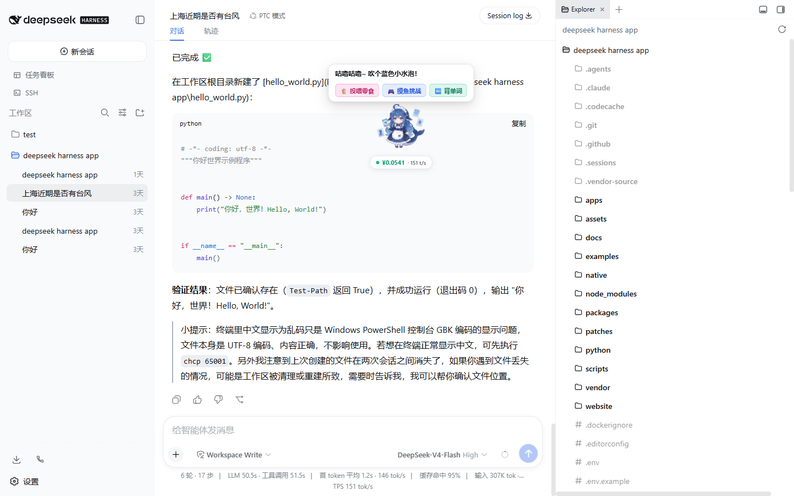
</p>

---

### 💬 5. 会话全生命周期与分支管理

> **解决的痛点**：探索多种提示词或代码方案时，以往需要手动复制上下文创建新对话。

* **会话分叉 (Fork)**：在任意会话节点一键分叉出新分支，独立探索不同方案而互不干扰。
* **原位管理**：支持右键菜单一键重命名、归档会话与彻底清理。

<p align="center">
  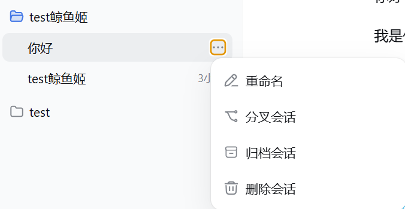
</p>

---

## 🚀 安装与快速上手

根据你的使用习惯选择最适合的安装方式：

```
                    ┌──────────────────────────────────────────────┐
                    │            你希望如何使用 DSH Studio？       │
                    └──────────────────────┬───────────────────────┘
                                           │
                 ┌─────────────────────────┴─────────────────────────┐
                 ▼                                                   ▼
        【普通用户 / 编程小白】                              【开发者 / 极客折腾】
                 │                                                   │
    下载桌面独立安装包 (方式 0)                         ┌─────────────┴─────────────┐
        • Windows: .exe (NSIS)                           ▼                           ▼
        • macOS: .dmg                               源码构建运行 (方式 1)       作为插件安装到已有 DSH (方式 2)
        • 零环境依赖，双击即用                       • pnpm install              • dsh plugin add ...
                                                     • 深度定制与开发            • 模块化自由插拔
```

### 方式 0：桌面独立安装包（编程小白推荐）

适合希望开箱即用的用户。安装包已完整内置 Node.js 运行时与 DSH Studio 全套核心插件，无需额外配置任何依赖。

| 操作系统 | 安装包格式 | 架构 | 安装说明 |
| :--- | :--- | :--- | :--- |
| **Windows** | `DSH-Studio-Setup-*.exe` | x64 (64位) | 双击运行 NSIS 安装引导，自动创建桌面与开始菜单快捷方式 |
| **macOS** | `DSH-Studio-*.dmg` | Apple Silicon (arm64, M1/M2/M3/M4) | 打开 DMG 镜像并将 `DSH Studio.app` 拖入 `Applications` 应用程序文件夹 |

> [!TIP]
> **macOS 首次打开提示“未识别的开发者”？**
> 1. 打开 **系统设置** > **隐私与安全性** > 下拉找到 DSH Studio，点击 **“仍要打开”** 即可；
> 2. 或在终端执行一行命令放行：
>    ```bash
>    xattr -cr /Applications/DSH\ Studio.app
>    ```

---

### 方式 1：从源码构建与运行 (Developer Mode)

适合需要二次开发、定制插件或向本项目贡献代码的开发者（需 `Node.js >= 22` 与 `pnpm 11+`）：

```bash
# 1. 克隆本仓库
git clone https://github.com/jiuge2467/DSH-WhaleDeck.git
cd DSH-WhaleDeck

# 2. 安装依赖并构建所有包
pnpm install
pnpm run build

# 3. 启动 DSH Web 工作台（默认监听 0.0.0.0:3080）
pnpm dsh web --host 0.0.0.0
```

启动完成后，在浏览器访问 `http://127.0.0.1:3080` 即可开始探索。

---

### 方式 2：作为插件增量安装至已有 DSH 环境

若你本地已有运行中的官方 DSH，可直接将 DSH Studio 插件安装到当前 `web` 配置文件中：

```bash
# 1. 安装 MCP 可视化管理中枢
cd ~/.dsh && dsh plugin --profile web add dsh-better-sidebar-mcp

# 2. 安装增强侧边栏（资源管理器、Git、终端、任务看板）
cd ~/.dsh && dsh plugin --profile web add dsh-better-sidebar

# 3. 安装小鲸鱼姬 2.0 灵动桌宠
cd ~/.dsh && dsh plugin --profile web add dsh-mascot-pet
```

重启 `dsh web` 后即可在界面中看到对应插件生效。

---

## 🏗️ 架构设计与技术选型

DSH Studio 桌面端采用 **“轻量 Electron 宿主 + 进程树守护 + 本地回环 Web 应用”** 的解耦架构：

```mermaid
flowchart TD
  subgraph Electron_Main["Electron 主进程 (Node.js 宿主)"]
    SingleInstance["单实例互斥锁 (Single Instance)"]
    AppLifecycle["生命周期调度器 (Ready / Activate / Quit)"]
    WindowManager["窗口管理器 (Splash 启动屏 -> 主窗口)"]
    TrayManager["系统托盘 (Tray 驻留与菜单)"]
    ServerDaemon["DSH 后端守护进程 (端口探测与健康检查)"]
    ProcessKiller["进程树级联清理器 (Tree-Kill)"]
  end

  subgraph DSH_Runtime["DSH Studio 运行时 (Cordis 微内核)"]
    WebServer["本地 Web 服务器 (http://127.0.0.1:3080)"]
    Plugin_MCP["🔌 MCP 管理中枢"]
    Plugin_Pet["🐬 小鲸鱼姬 2.0 桌宠"]
    Plugin_Vision["🧠 CoT 视觉引擎"]
    Plugin_Sidebar["🧰 增强侧边栏套件"]
  end

  subgraph Renderer["Chromium 渲染层 (Web GUI)"]
    Web_UI["React 18 + CSS Modules + Vite"]
  end

  SingleInstance --> AppLifecycle
  AppLifecycle --> ServerDaemon
  AppLifecycle --> WindowManager
  AppLifecycle --> TrayManager
  ServerDaemon --> ProcessKiller
  ServerDaemon -->|启动并监控| WebServer
  WebServer --> Plugin_MCP
  WebServer --> Plugin_Pet
  WebServer --> Plugin_Vision
  WebServer --> Plugin_Sidebar
  ServerDaemon -->|HTTP 200 就绪信号| WindowManager
  WindowManager -->|加载 URL| Renderer
```

### 技术栈选型矩阵

| 分层 | 组件 / 工具 | 用途与选型依据 |
| :--- | :--- | :--- |
| **桌面宿主** | `Electron ^35.0.0` | 跨平台桌面容器，提供系统托盘、原生菜单与单实例互斥锁 |
| **安装打包** | `electron-builder ^25.1.8` | 构建生成 Windows NSIS 安装包与 macOS DMG 镜像 |
| **前端交互** | `React 18` + `CSS Modules` | 现代响应式 UI，高颜值磨砂玻璃与卡片式设计 |
| **插件微内核** | `Cordis` + `DSH Core` | 高度解耦的插件微内核，支持依赖注入与动态生命周期效果 |
| **核心语言** | `TypeScript` (Strict ESM) | 全仓严格类型检查与完整导出 JSDoc 契约约束 |
| **工程构建** | `pnpm` + `tsdown` + `Vite` | Monorepo 工作区管理与毫秒级构建打包 |
| **测试框架** | `Vitest` | 单元测试、集成测试、快照测试与覆盖率审计 |
| **持续集成** | `GitHub Actions` | 跨平台自动化测试矩阵与 Release 产物发布流 |

---

## 🧩 内置插件生态、参考引用与专项优化

DSH Studio 站在 DeepSeek Harness 官方框架与活跃开源社区的肩膀上。我们内置、重构并深度优化了数个核心基础设施插件，以打造开箱即用的工业级桌面体验：

| 插件包名 | 定位与核心功能 | 上游参考 / 来源 | DSH Studio 所做出的关键优化与重构 |
| :--- | :--- | :--- | :--- |
| **`dsh-mascot-pet`** | 🐬 小鲸鱼姬 2.0 灵动桌宠 | 社区桌宠与虚拟伴侣方案 | • **零残留生命周期重构**：彻底修复「已关闭」状态下对话气泡残留及漫步引擎后台持续运行的 Bug（引入 `return null` 顶层卸载守卫 + `wanderEngine.interrupt()` 级联销毁）。<br>• **换装中心**：集成 3 套高精无痕立绘（经典女仆 / 赛博极客 / 夏日水手），支持免刷新一键蜕变。<br>• **极速背单词**：专为四六级与 GRE 打造 650ms 自动切词流，支持 A/B/C/D 纯键盘盲打。<br>• **解压娱乐中心**：内置星海小水泡反应挑战、2048 极光、霓虹打砖块与美食决策随机转盘。<br>• **实时 Token 账单看板**：当前会话消费、全站累计计费、实时 TPS 吞吐监控与月度预算进度条。 |
| **`dsh-better-sidebar-mcp`** | 🔌 MCP 多源可视化管理中枢 | 社区 MCP 管理工具与规范 | • **跨工具配置自动扫描**：深度扫描 `./mcp.json`、`.cursor/`、`.vscode/`、`Claude Desktop`、`Gemini/Antigravity` 与 `~/.dsh/` 多源配置。<br>• **Tool Tester 在线沙箱**：可视化 JSON Schema 入参表单，支持发起真实 RPC 调用并毫秒级统计执行延迟。<br>• **批量 JSON 解析**：支持直接粘贴 `mcpServers` JSON 片段一键导入，支持单服务热启停。 |
| **`dsh-better-sidebar`** / **`dsh-task-board`** | 🧰 7 合 1 增强侧边栏与任务看板 | 社区侧边栏与 Kanban 方案 | • **7 合 1 多功能中枢**：资源管理器、Git 差异管理、任务看板、终端、技能、MCP、浏览器无缝切换。<br>• **内置持久化终端**：集成原生 Windows ConPTY / Unix PTY 命令行，免切窗口直接执行 Shell/PowerShell。<br>• **5 列可视化任务看板**：实时追踪会话任务状态（待处理/待办/进行中/已完成/已失败）与 Durable 状态联动。 |
| **`dsh-tool-describe-image`** | 🧠 CoT 视觉思考链引擎 | 多模态视觉工具 | • **深度思考大模型专属优化**：专为带推理能力的视觉模型（如 Xiaomi MiMo、DeepSeek-R1 系列）优化流式解析，彻底解决首 token 空白卡死问题，实时完整呈现 `reasoning_content` 推理折叠块。<br>• **可视化连通性探测**：支持图形化连通性测试与往返延迟基准测速，自动枚举上游模型清单。 |
| **`dsh-web-ui-settings`** | ⚙️ Studio 增强插件配置中枢 | Web UI 设置面板 | • **全栈品牌体系升级**：重塑插件配置面板文案与字典，全面去 `dsh-web-ui` 历史包袱，确立统一的 DSH Studio 品牌语境。<br>• **本地 Loopback 设置桥接**：打通第三方命名空间的本地回环设置变更与配置热重载。 |
| **`dsh-liangshen`** | ⚡ 自定义 Agent 预设 (南梁模式) | 社区 Agent Preset 方案 | • 针对 V4 Pro 调优专属提示词引导，支持通过「创造模式」快速克隆与二次创作。 |

### 🌐 开源社区生态致敬与索引

我们在此向所有为 DSH 生态做出杰出贡献的开源创作者致以由衷的感谢（已收录至社区插件索引）：
* 📊 [**dsh-data-agent**](https://github.com/omdsh-dev/dsh-data-agent) by `@omdsh-dev`：专为数据查询、更新与分析打造的专用 Data Agent 预设。
* 📟 [**dsh-TUI**](https://github.com/ccch1mneyyy/dsh-TUI) by `@ccch1mneyyy`：Claude Code 风格全屏交互终端插件，配备像素鲸鱼顶栏与实时 TPS 仪表。
* 📜 [**dsh-tianshu-tui**](https://github.com/huiliyi37/dsh-tianshu-tui) by `@huiliyi37`：基于 DeepSeek Harness 的交互式终端 UI，增加 TDD 与证据门等工作流。
* 📝 [**dsh-chat-summary**](https://github.com/v833/dsh-chat-summary) by `@v833`：对话总结并导出为 Markdown / DOCX / PDF，支持自配 Key 智能总结。
* 🔍 [**dsh-builtin-toggles**](https://github.com/Starfie1d1272/dsh-builtin-toggles) by `@Starfie1d1272`：Evidence-backed 内置能力检查器与 fail-closed 安全开关。

---

我们坚持开源软件的真实与坦诚原则，以下是 DSH Studio 的客观优势与当前局限：

### 🌟 核心优势 (Pros)
1. **极致的使用体验**：预打包桌面端彻底消除了小白用户在 Node.js、pnpm 及终端配置上的所有摩擦；
2. **丰富的开箱套件**：内置 5 大增强插件，无需繁琐的配置文件修改即可拥有完整现代 Agent 工作台体验；
3. **强大的多源 MCP 聚合**：一站式打通 Cursor、Claude Desktop、VSCode 与 DSH 的所有 MCP 工具并支持在线调试；
4. **完全遵循官方标准**：100% 遵循 upstream DSH 的 Cordis 插件规范，所有功能均为独立模块，可自由拆装；
5. **后台任务安全保活**：支持最小化至系统托盘，避免误关窗口导致后台长时间运行的 Agent 任务中断；
6. **完全开源透明**：采用宽松的 [MIT License](LICENSE)，代码结构清晰，易于审计与二次开发。

### ⚠️ 当前局限与应对 (Cons)
1. **预编译安装包平台**：当前首发提供 Windows x64 与 macOS Apple Silicon (arm64) 安装包，*Linux 用户可通过源码构建（方式 1）稳定运行*；
2. **macOS 签名提示**：自签名安装包在 macOS 上首次打开可能触发 Gatekeeper 拦截，*在系统设置中点击“仍要打开”或通过一行命令即可快速放行*；
3. **需自备 API Key**：DSH Studio 是本地 Agent 调度工作台，*用户需自行配置 DeepSeek 或兼容 OpenAI 协议的 API 密钥*；
4. **安装包体积略大**：因内置了完整的 Node.js 运行时与 Chromium 引擎，安装包体积大于纯 CLI 工具，*后续将通过 ASAR 压缩与依赖 Tree-shaking 持续优化*；
5. **云端插件市场规划中**：一键式云端插件商店正在开发路线图中，未来将支持在界面中一键搜索与安装社区插件。

---

## 🧪 自动化测试与质量保障

DSH Studio 拥有严格的单元测试、覆盖率门禁与端到端自动化测试套件：

```bash
# 运行全仓库单元测试
pnpm test

# 运行 CI 代码覆盖率门禁检查
pnpm run test:coverage

# 运行特定插件的测试用例（如小鲸鱼姬桌宠）
pnpm --filter dsh-mascot-pet test
```

---

## 🤝 社区贡献与共建

热烈欢迎社区开发者与爱好者共同参与共建！无论是提交 Issue、设计新立绘皮肤、开发新插件还是完善文档：

1. **Fork** 本仓库
2. 创建特性分支：`git checkout -b feat/YourAwesomeFeature`
3. 提交代码变更：`git commit -m 'feat: add some amazing feature'`
4. 推送分支：`git push origin feat/YourAwesomeFeature`
5. 发起 **Pull Request**

详情请参阅 [CONTRIBUTING.md](CONTRIBUTING.md)。

---

## 📄 开源协议

本项目基于 [MIT License](LICENSE) 开源协议分发与使用。
