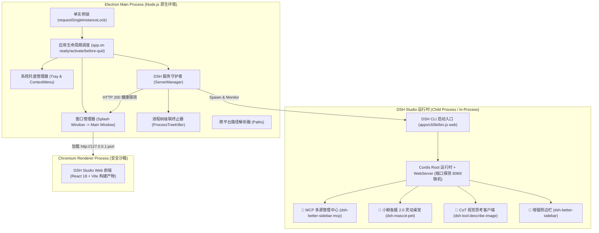
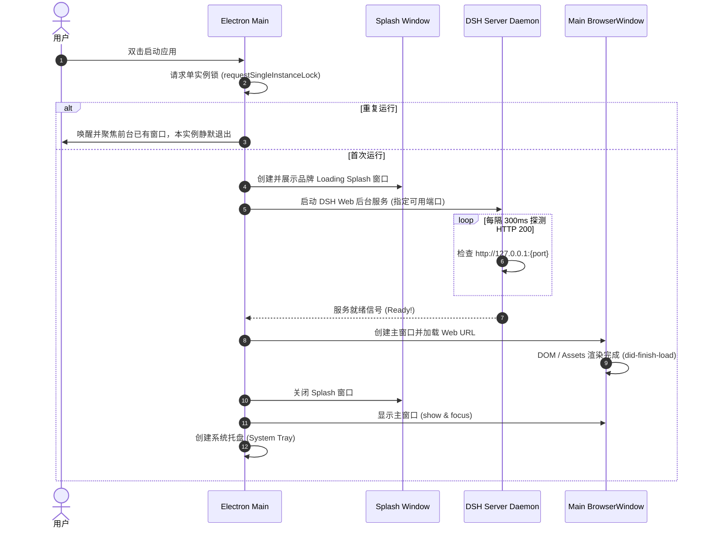
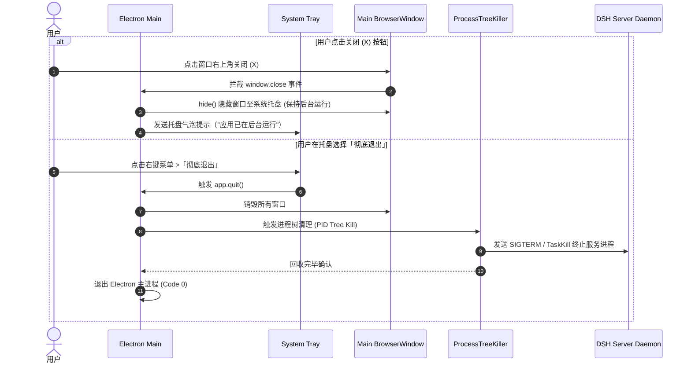

# DSH Studio Desktop 桌面端系统架构设计说明书 (Architecture Spec)

> **版本**：v1.0.0  
> **责任角色**：🏗️ ARCH (系统架构师)  
> **文档状态**：待评审 (Phase 2 Spec 锁定中)  
> **前置依赖**：`docs/PRD_DESKTOP.md` (已通过)

---

## 1. 架构总览与设计理念 (Architecture Overview)

DSH Studio Desktop 采用 **“薄 Electron 宿主 + 进程树托管 + 本地环回 Web 承载”** 的现代化桌面架构设计。Electron 主进程作为宿主，负责原生窗口、托盘、系统菜单与单实例控制；内置的 DSH Studio Web 运行时作为独立工作进程在后台启动并挂载全部插件（MCP 管理中心、桌宠、CoT、侧边栏），并通过 Localhost (127.0.0.1) 环回网络向 Chromium 渲染器提供服务。



---

## 2. 技术选型与版本锚定 (Tech Stack Matrix)

| 层次 | 选型组件 | 锁定版本 | 选型理由与优势 |
| :--- | :--- | :--- | :--- |
| **桌面宿主** | `electron` | `^35.0.0` | 采用最新稳定版 Electron，原生支持 Node.js 22+ API 与最新 Chromium 引擎 |
| **安装包构建** | `electron-builder` | `^25.1.8` | 工业级跨平台打包工具，原生支持 NSIS (Windows x64) 与 DMG (macOS Apple Silicon arm64) |
| **构建与转译** | `tsx` / `typescript` | `^4.22.4` / `^6.0.3` | 与根项目保持完全一致的 ESM + TypeScript 构建体系 |
| **进程管理** | `tree-kill` / 原生 `taskkill` | `^1.2.2` | 确保在 Windows/macOS 下退出时 100% 回收整个进程树，无孤儿进程残留 |
| **网络探测** | `get-port` | `^7.1.0` | 智能寻找空闲 Loopback 端口，避免 3080 端口冲突导致崩溃 |

---

## 3. 核心子系统与时序设计 (Subsystems & Sequence)

### 3.1 启动与就绪时序图 (Startup Sequence)



### 3.2 退出与进程回收时序图 (Teardown Sequence)



---

## 4. 目录结构规范 (Project Structure)

在工作空间中新增 `apps/desktop` 子包，与 `apps/web` 和 `apps/cli` 平级并纳入 pnpm workspace 管理：

```
apps/desktop/
├── package.json              # 子包清单 (声明 electron, electron-builder)
├── tsconfig.json             # TypeScript 构建配置
├── electron-builder.yml      # 打包配置文件 (NSIS / DMG / ASAR 规则)
├── resources/                # 原生资源目录
│   ├── icon.ico              # Windows 多尺寸高清图标 (256x256)
│   ├── icon.icns             # macOS 高清应用图标
│   ├── icon.png              # 托盘与 Linux 图标 (512x512)
│   └── splash.html           # 优雅的启动 Loading 画面
├── src/
│   ├── main/
│   │   ├── index.ts          # Electron 主进程入口 (单实例锁、生命周期)
│   │   ├── window.ts         # 主窗口与 Splash 窗口管理
│   │   ├── tray.ts           # 系统托盘管理 (右键菜单与交互)
│   │   ├── server-manager.ts # DSH Server 进程启动、端口探测与健康检查
│   │   ├── process-killer.ts # 跨平台强健进程树清理器
│   │   └── paths.ts          # 数据目录、日志目录、插件目录解析
│   └── preload/
│       └── index.ts          # 安全 Preload 脚本
└── scripts/
    ├── prepare-bundle.ts     # 打包前资源组装脚本 (集成前端 dist 与核心插件)
    └── release.ts            # 发布打包执行脚本
```

---

## 5. 打包与跨平台分发规范 (Packaging Spec)

### 5.1 ASAR 与物理依赖规则
- **ASAR 保护**：核心代码与前端静态资源打包入 `app.asar`，保护代码完整性并加快加载速度。
- **ASAR Unpack 解包规则**：
  * 将 Node.js 二进制插件、PTY 原生依赖（`node-pty` / `pty.node` / `spawn-helper`）、预装插件包路径配置在 `asarUnpack`，确保跨平台系统调用不会因虚拟路径报错。

### 5.2 平台目标产物规范 (Platform Targets)

1. **Windows (x64)**：
   - 目标格式：`nsis` (单文件安装程序)
   - 产物命名：`DSH-Studio-Setup-${version}-win-x64.exe`
   - 安装体验：支持一键安装、支持自定义安装路径、创建开始菜单与桌面快捷方式、提供完整卸载向导。
2. **macOS (Apple Silicon - arm64)**：
   - 目标格式：`dmg` (磁盘映像)
   - 产物命名：`DSH-Studio-${version}-mac-arm64.dmg`
   - 安装体验：打开 DMG 即可拖拽 `DSH Studio.app` 到 `Applications`。

---

## 6. GitHub Actions CI/CD 流水线设计 (CI/CD Spec)

建立 `.github/workflows/desktop-release.yml`，在推送到 `v*` 标签或手动触发时执行跨平台矩阵构建：

```yaml
name: Build and Release Desktop App

on:
  push:
    tags:
      - 'v*'
  workflow_dispatch:

jobs:
  build:
    strategy:
      matrix:
        include:
          - os: windows-latest
            target: win-x64
            npm_script: build:win
          - os: macos-latest # macOS 14+ 默认运行在 Apple Silicon (M1/M2/M3)
            target: mac-arm64
            npm_script: build:mac
    runs-on: ${{ matrix.os }}
    steps:
      - uses: actions/checkout@v4
      - uses: pnpm/action-setup@v3
        with:
          version: 11.7.0
      - uses: actions/setup-node@v4
        with:
          node-version: 24
          cache: 'pnpm'
      - run: pnpm install
      - run: pnpm run build
      - name: Build Desktop App
        run: pnpm --filter @deepseek-ai/dsh-desktop run ${{ matrix.npm_script }}
      - name: Generate SHA-256 Checksums
        run: ...
      - name: Upload Release Assets
        uses: softprops/action-gh-release@v2
        with:
          files: |
            apps/desktop/release/*.exe
            apps/desktop/release/*.dmg
            apps/desktop/release/*.sha256
```

---

## 7. Spec 锁定清单 (Spec Lock Checklist)

| 规范条目 | 规范约定 | 确认状态 |
| :--- | :--- | :---: |
| **宿主框架** | Electron 35 + TypeScript ESM | 🔒 已锁定 |
| **架构模式** | Electron Main 托管 DSH Loopback Web Server + Chromium 沙箱渲染 | 🔒 已锁定 |
| **交付平台** | Windows x64 (NSIS) + macOS Apple Silicon arm64 (DMG) | 🔒 已锁定 |
| **目录位置** | `apps/desktop` 子包，统一 pnpm workspace 编排 | 🔒 已锁定 |
| **生命周期** | 启动 Splash 预热 -> 单实例锁 -> 最小化托盘 -> 退出级联杀死进程树 | 🔒 已锁定 |
| **CI/CD** | GitHub Actions 跨平台矩阵构建与自动发布 | 🔒 已锁定 |
