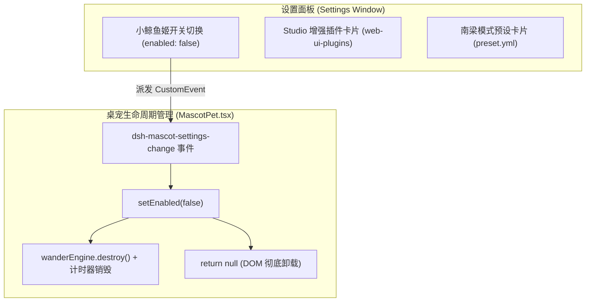

# DSH Studio 体验升级与文案品牌规范化 技术架构与开发文档

> **文档版本**：v1.0.0  
> **责任角色**：ARCH / DEV  

---

## 1. 架构变更总览

本期变更覆盖三个核心插件与设置扩展面：
1. `plugins/dsh-mascot-pet`：小鲸鱼姬桌面伴侣生命周期控制与漫步引擎销毁机制重构
2. `plugins/dsh-web-ui-settings`：多语言字典更新、插槽与全家桶元数据重定义
3. `plugins/dsh-liangshen`：预设配置文件与元数据重构



---

## 2. 核心模块实现方案

### 2.1 模块 1：小鲸鱼姬生命周期与漫步引擎销毁 (`dsh-mascot-pet`)

**文件**：`plugins/dsh-mascot-pet/src/client/MascotPet.tsx`

**缺陷根因**：
- 原代码仅对主精灵头像进行 `{enabled && ...}` 条件包裹，导致对话气泡 `MascotBubble`、状态条 `statusPill` 和 `MascotDashboard` 仍然在 `enabled === false` 时保留在 DOM 中。
- `wanderEngine` 的 `useEffect` 中依赖 `wanderEnabled && !panelOpen && !running`，未将 `enabled` 纳入控制条件，导致计时器一直在后台派发移动坐标，使未卸载的气泡在屏幕上漂移。

**技术改造**：
1. **漫步引擎守卫**：
   ```ts
   wanderEngine.setEnabled(enabled && wanderEnabled && !panelOpen && !running)
   if (!enabled) {
     wanderEngine.interrupt()
   }
   ```
2. **闲置动作与饥饿自检计时器守卫**：
   在 `useEffect` 中增加 `if (!enabled) return` 守卫，避免在关闭状态下创建无用计时器。
3. **顶层组件早退（Fail-Fast Unmount）**：
   在 `MascotPet` 返回 JSX 的最上方：
   ```ts
   if (!enabled) {
     return null
   }
   ```
   彻底确保没有任何 DOM 节点、事件捕获层或定时器残留。

---

### 2.2 模块 2：设置面板品牌文案与字典重构 (`dsh-web-ui-settings`)

**文件**：`plugins/dsh-web-ui-settings/src/client/locales.ts`

**字典改造**：
```ts
export const zh = {
  'title': 'Studio 增强插件',
  'description': '统一管理 DSH Studio 全栈增强插件套件的启用与个性化配置。',
  'expand': '展开',
  'collapse': '收起',
  'empty': '没有已安装的 DSH Studio 插件。',
} satisfies Record<string, string>

export const en = {
  'title': 'Studio Enhanced Plugins',
  'description': 'Enable and customize the DSH Studio full-stack plugin suite in one place.',
  'expand': 'Show plugins',
  'collapse': 'Hide plugins',
  'empty': 'No DSH Studio plugins installed.',
} satisfies Record<WebUIPluginsKey, string>

export const communityPluginsZh = {
  'title': '社区插件',
  'description': '社区贡献者开发与维护的独立插件，链接指向作者自身的开源仓库。',
  'expand': '展开',
  'collapse': '收起',
  'empty': '暂无社区插件登记。',
  'author': '作者',
  'repository': '仓库',
  'notice': '条目由贡献者自行登记，与 DSH Studio 的发布内容无关；使用前请自行评估。',
} satisfies Record<string, string>

export const communityPluginsEn = {
  'title': 'Community Plugins',
  'description': "Independent plugins developed and maintained by community contributors.",
  'expand': 'Show plugins',
  'collapse': 'Hide plugins',
  'empty': 'No community plugins registered yet.',
  'author': 'Author',
  'repository': 'Repository',
  'notice': 'Entries are contributed by their authors and are separate from DSH Studio releases; evaluate before use.',
} satisfies Record<CommunityPluginKey, string>
```

---

### 2.3 模块 3：Agent 预设重命名 (`dsh-liangshen`)

**文件**：
- `plugins/dsh-liangshen/presets/liangshen/preset.yml`
- `plugins/dsh-liangshen/presets/liangshen/agent.cordis.yml`
- `plugins/dsh-liangshen/package.json`

**改造内容**：
```yaml
name: 南梁模式
description: V4 Pro 专属，小南梁进化，南梁，启动！
order: 4
```

---

## 3. 文件修改范围清单 (Change List)

| 序号 | 目标文件 | 变更类型 | 说明 |
| :---: | :--- | :---: | :--- |
| 1 | `plugins/dsh-mascot-pet/src/client/MascotPet.tsx` | 修改 | 添加 `!enabled` 顶层卸载、漫步引擎联动与计时器清理 |
| 2 | `plugins/dsh-web-ui-settings/src/client/locales.ts` | 修改 | 重构中英文字典，全面替换为 DSH Studio 品牌与增强描述 |
| 3 | `plugins/dsh-liangshen/presets/liangshen/preset.yml` | 修改 | 将「梁神模式」变更为「南梁模式」 |
| 4 | `plugins/dsh-liangshen/package.json` | 修改 | 更新插件展示名称与描述 |
