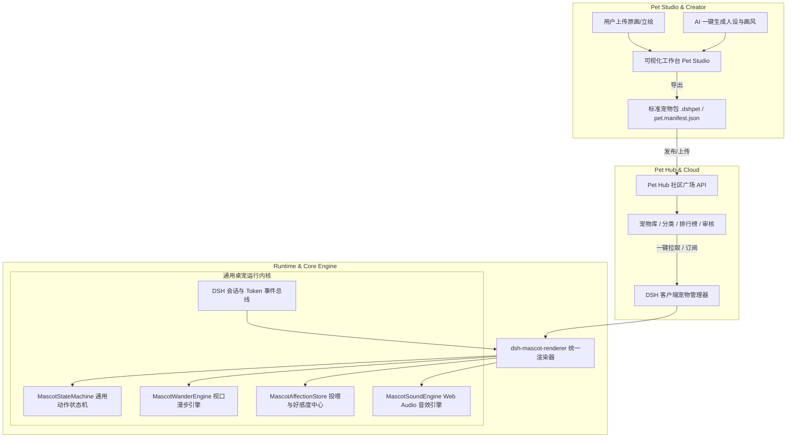
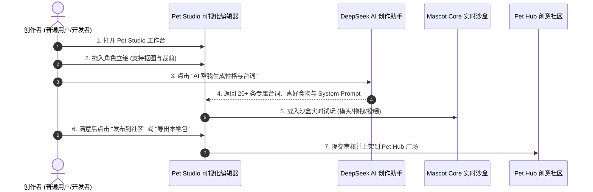
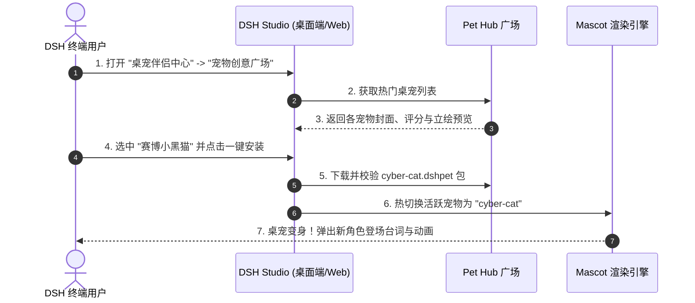

# 产品与技术架构方案：小鲸鱼姬通用模板化与专属宠物创意工坊 (Pet Studio & Pet Hub)

> **文档性质**：Phase 1 / Phase 2 产品需求分析、可行性论证与系统架构方案说明书  
> **规划编号**：FP-001  
> **责任角色**：🎯 PM（产品经理） + 🏗️ ARCH（系统架构师）  
> **适用范围**：`dsh-mascot-pet` 架构升级、`dsh-pet-studio` 创作工具、`dsh-pet-hub` 创意社区  
> **状态**：🟡 未来规划储备 (On Hold - 暂不实施)  
> **版本**：v1.0.0-PROPOSAL

---

## 1. 需求背景与业务愿景 (Vision & Background)

### 1.1 业务背景
当前 DSH Studio 已经成功上线了「小鲸鱼姬 2.0」动态桌宠伴侣，具备呼吸、漫步、思考感知、工具检修、摸头、投喂、Token 计费及摸鱼游戏等完整交互生态，深受好评。
用户提出了强烈的个性化与社交诉求：**“能否把小鲸鱼姬抽成一个通用模板，让其他开发者/二次元爱好者可以上传自己喜欢的角色（如猫娘、柴犬、原神角色、机甲、像素精灵），一键生成专属桌宠，并分享到宠物社区中？”**

### 1.2 目标定位
* 🎨 **0 门槛宠物工坊 (Pet Studio)**：用户只需准备几张静态/动态立绘，通过可视化界面配置人设与台词，即可导出专属桌宠。
* 🤖 **AI 赋能一键生宠 (AI Pet Generator)**：结合 DeepSeek 大模型自动生成宠物性格、专属互动台词，结合生图模型自动生成多状态透明立绘。
* 🌐 **开放式创意社区 (Pet Hub / Marketplace)**：类似 Steam 创意工坊或 VS Code 主题市场，用户可在线浏览、试玩预览、一键安装、点赞与分享桌宠。

---

## 2. 总体架构设计与解耦拓扑 (System Topology)

我们将原有的单体桌宠系统解耦为 **内核引擎 (Core Engine)、资产协议 (Pet Spec)、创作工具 (Pet Studio)、分发社区 (Pet Hub)** 四层架构：



---

## 3. 标准宠物描述清单规范 (`pet.manifest.json` Spec)

每个专属桌宠是一个自包含的 `.dshpet` 压缩包（或文件夹），根目录下包含 `pet.manifest.json` 与相关资产。

```typescript
/** 宠物标准描述清单契约 (Pet Manifest Schema) */
export interface PetManifest {
  /** 规范版本 */
  schemaVersion: '1.0.0'
  
  /** 基础元数据 */
  meta: {
    id: string                 // 唯一英文标识，例如 "genshin-furina", "cyber-cat"
    name: string               // 宠物显示名称，例如 "芙宁娜", "赛博小黑猫"
    version: string            // 语义化版本号，例如 "1.0.0"
    author: string             // 作者名 / 社交主页
    description: string        // 宠物简要介绍
    avatar: string             // 头像图标 (相对路径或 Base64)
    tags: string[]             // 标签，例如 ["二次元", "猫咪", "极客", "治愈"]
    themeColor: string         // 专属主题色 (Hex/RGB)，用于气泡与高光
  }

  /** Agent 提示词感知与人设 */
  agent: {
    systemPrompt: string       // 注入给 DeepSeek 模型的角色背景设定
    interactToolName?: string  // 绑定的专属工具名 (默认 pet_interact)
    personalityTag: string     // 性格特征 (傲娇/元气/严谨/温柔)
  }

  /** 状态立绘映射表 (可为 PNG/SVG/WebP/GIF/Lottie) */
  assets: {
    /** 核心动作帧 */
    states: {
      idle: string             // 默认呼吸状态立绘 (必需)
      happy: string            // 开心/抚摸/喂食状态立绘 (必需)
      thinking?: string        // 正在思考/深度推理中立绘
      tool?: string            // 工具检修/查阅文件中立绘
      celebrate?: string       // 任务完成撒花立绘
      dizzy?: string           // 报错/晕眩立绘
      dragging?: string        // 鼠标拖拽悬空扑腾立绘
      sleep?: string           // 闲置打瞌睡立绘
    }
    /** 可选音效映射 */
    sounds?: {
      onClick?: string         // 点击音效 (内置合成音代码 或 音频文件相对路径)
      onFeed?: string          // 投喂音效
      onThinking?: string      // 思考音效
      onComplete?: string      // 完成庆祝音效
    }
  }

  /** 台词与气泡文案库 */
  dialogues: {
    greetings: string[]        // 启动/唤醒问候语列表
    pettings: string[]         // 摸头抚摸时的随机台词
    agentThinking: string[]    // 模型推理时的随机台词
    agentDone: string[]        // 任务完成时的夸夸台词
    agentFailed: string[]      // 任务失败/报错时的安慰台词
    idleChatters: string[]     // 挂机摸鱼时的随机碎碎念
  }

  /** 投喂与喜好配置 */
  feeding?: {
    favoriteFoods: Array<{
      id: string
      name: string             // 食物名称，例如 "马卡龙", "小鱼干"
      icon: string             // Emoji 或 图标路径
      affectionBonus: number   // 好感度加成值 (+10 ~ +50)
      reactionQuote: string    // 吃到最爱食物时的专属台词
    }>
  }

  /** 行为特征调优参数 */
  behavior?: {
    wanderRangePx?: number     // 水平游弋距离区间 (默认 90px)
    wanderIntervalSec?: number // 游弋触发间隔 (默认 8~15s)
    enablePhysicsShake?: boolean // 是否开启拖拽扑腾与惯性摆动
  }
}
```

---

## 4. 核心功能模块设计

### 4.1 模块一：`dsh-mascot-core` (通用桌宠运行引擎)
* **职责**：将现有 `dsh-mascot-pet` 中的业务逻辑抽离为纯粹的、无立绘绑定的**桌宠引擎 SDK**。
* **数据驱动**：传入任意合法的 `PetManifest`，引擎自动创建 `MascotStateMachine`、绑定事件监听、挂载 Canvas/DOM 渲染层。
* **热切换能力**：支持用户在不刷新页面的情况下，直接在「小鲸鱼姬」、「赛博猫咪」、「魔法少女」之间秒级无缝切换，保留当前好感度与会话状态。

### 4.2 模块二：`dsh-pet-studio` (零代码/AI 宠物工坊)
提供一个极简可视化的 Web 创作工作台（内置在 DSH Studio 设置或独立网页）：
1. **三步向导生成**：
   - **Step 1: 形象上传**：拖入 1~3 张角色立绘，支持内置“一键智能抠图（消除背景）”与尺寸自动裁切。
   - **Step 2: 性格与台词**：输入角色名字与性格标签（例如“傲娇程序员猫娘”），点击「AI 帮我写台词」，DeepSeek 自动生成一整套 20+ 条生动台词。
   - **Step 3: 实时沙箱试玩**：在右侧沙箱里实时点击、拖拽、测试投喂与气泡效果。
2. **一键导出**：打包生成 `.dshpet` 文件，或直接一键同步到本地 DSH 客户端。

```
┌────────────────────────────────────────────────────────────────────────────┐
│ 🎨 DSH Pet Studio (宠物工坊)                        [ 🤖 AI 一键生成 ] [ 💾 导出 .dshpet ] │
├───────────────────────────────────┬────────────────────────────────────────┤
│ 1. 基础信息配置                   │ 3. 实时交互测试沙盒 (Live Sandbox)     │
│   • 宠物名称: [ 赛博小黑猫      ] │                                        │
│   • 主题色彩: [ ■ #00f0ff (霓虹蓝) ] │           ┌──────────────────────┐     │
│   • 性格特征: [ 软萌 / 极客     ] │           │ 🐱 (自主游弋/呼吸)   │     │
│                                   │           │ "主人代码写得好棒喵!"│     │
│ 2. 立绘状态切片映射               │           └──────────────────────┘     │
│   • 默认呼吸 (Idle):  [+ 上传] ✅ │    [ 摸摸头 ] [ 喂小鱼干 ] [ 模拟思考 ] │
│   • 抚摸开心 (Happy): [+ 上传] ✅ │                                        │
│   • 专注检修 (Tool):  [+ 上传] ⚪ │ 4. 诊断自检                            │
│   • 报错眩晕 (Dizzy): [+ 上传] ⚪ │   • 必须项检查: 100% 通过               │
│                                   │   • 资源包体积: 1.2 MB (优)            │
└───────────────────────────────────┴────────────────────────────────────────┘
```

### 4.3 模块三：`dsh-pet-hub` (宠物创意社区与广场)
* **广场浏览**：分类展示热门桌宠（官方精选、二次元、动物萌宠、像素怀旧、搞怪鬼畜）。
* **在线试玩**：点击任意宠物卡片，直接在页面右下角临时唤起该宠物进行互动体验。
* **一键安装 / 卸载**：点击「获取」，通过 DSH 客户端的 IPC/RPC 协议，秒级下载并挂载到本地桌面。
* **社区互动**：点赞、收藏、创作者打赏、版本更新推送。

---

## 5. 用户交互旅程图 (User Journeys)

### 5.1 创作者旅程（从想法到专属桌宠）


### 5.2 玩家旅程（从浏览到一键装载）


---

## 6. 工作量精确估算与实施路线图 (Roadmap & Sizing)

### 6.1 工作量拆解一览表
| 任务模块 | 细分工作项 | 难易度 | 预计耗时 |
| :--- | :--- | :---: | :---: |
| **M1: 引擎内核解耦** | 1. 抽离 `MascotStateMachine` 与 `MascotWanderEngine` 为数据驱动<br>2. 制定 `pet.manifest.json` TypeScript 契约与校验器<br>3. 将现有小鲸鱼姬重构为第一个标准 `default-whale.dshpet` | 🟢 简单 | 2 人日 |
| **M2: 本地宠物管理** | 1. 在桌面端/Web 端实现「宠物衣橱/管理面板」<br>2. 支持从本地文件夹或 `.zip` 导入自定义宠物<br>3. 宠物的持久化存储与 LocalStorage 记忆 | 🟢 简单 | 2 人日 |
| **M3: 可视化 Studio** | 1. 搭建前端轻量向导页面 (上传/台词/音频/沙盒测试)<br>2. 接入 Canvas 简易抠图与透明背景预处理<br>3. 接入 DeepSeek API 自动生成人设与台词库<br>4. 前端一键 Zip 打包导出 `.dshpet` | 🟡 中等 | 4 人日 |
| **M4: 创意社区广场** | 1. 轻量化后端 API (列表/详情/上传/下载/点赞)<br>2. DSH 客户端「社区广场」Tab 嵌入<br>3. 一键在线下载与自动解压挂载 | 🟡 中等 | 5 人日 |
| **总计估算** | **完整端到端交付 (内核 + 本地导入 + 可视化工坊 + 社区广场)** | 🎯 良好 | **约 13 人日**<br>(~2.5 周) |

---

## 7. 风险评估与防御策略 (Risk & Defense)

1. **立绘图片体积过大影响性能**：
   - *防御*：Pet Studio 客户端打包时强制进行 WebP 压缩与分辨率上限限制（例如建议宽 512px，单图 ≤ 200KB）。
2. **社区用户上传违规/不适宜图片**：
   - *防御*：Pet Hub 增加基础图片安全风控探测（如 Cloudflare / 本地模型违规过滤）与社区举报下架机制。
3. **不同角色的宽高比不一致导致拖拽错位**：
   - *防御*：`MascotPet` 容器采用基于 `contain` 的弹性自适应外框，漫步引擎根据实际渲染尺寸动态计算中心碰撞包围盒。
